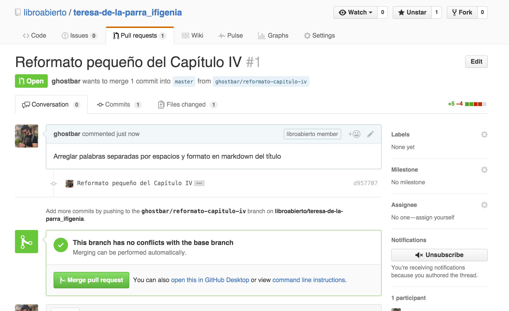

# Cómo ayudo a editar los libros del proyecto Libro Abierto

## Requisitos

* Abrirse una cuenta en GitHub
* [Entender markdown](https://guides.github.com/features/mastering-markdown/)

## Pasos para editar

1. Vé a algún repositorio, como
   [este](https://github.com/libroabierto/teresa-de-la-parra_ifigenia) y
   selecciona el archivo que quieras editar, haz click en él:

   

2. Busca el botón de editar que se encuentra en la parte superior derecha y haz
   click allí:

   

3. Cambia el archivo en el editor de texto que consigues:

   

4. Propón los cambios: dale una descripción corta como título y explica en la
   descripción larga todo lo que hiciste. Recuerda darle al botón que dice
   "Create a new branch" si te aparece, así mismo, darle un buen nombre que use
   tu usuario y la descripción corta. Si tu usuario es mariaperez y los cambios
   son correción de tildes, un buen nombre sería:
   `mariaperez/correccion-de-tildes`. Irónicamente en este ejemplo, no se
   aceptan tildes ni caractéres especiales :-)

   Una vez hayas hecho esto, dale a "Propose file change"

   

5. Eso te dirigirá a una página nueva, allí haz las modificaciones necesarias en
   la descripción y luego le das a "Create pull request"
   
   

6. ¡Excelente! Haz hecho una propuesta de cambio y alguno de los editores del 
   libro lo mezclará para que entren. Otras personas, además de los editores,
   pueden revisar tus cambios y hacerles correcciones en los comentarios,
   también tú puede que quieras corregir algunas cosas, es simple, en la misma
   página del pull request dale click en la pestaña "Files changed" y allí busca
   el botón editar en el archivo, parte superior derecha, y vuelves a la página
   del paso 3.

   
